# Proxmox VE and pfSense Security Hardening

## Overview

This homelab hardening exercise established a more defensible administrative baseline for a Proxmox VE host and its pfSense virtual firewall. The work focused on reducing dependence on default administrative identities, limiting management exposure, removing repository errors, enabling host firewall enforcement, and preserving recovery artifacts.

The changes below distinguish completed work from follow-up improvements. Private credentials, SSH keys, pfSense XML contents, and backup archive contents are intentionally excluded.

## Lab Environment

The work was performed on October 5, 2026, in a private homelab:

| Component | Verified environment detail |
| --- | --- |
| Proxmox VE | 9.1.1; hostname `pve` |
| Proxmox management | `192.168.1.50/24`; gateway `192.168.1.1` |
| pfSense VM | VM ID `103`; version `2.8.1-RELEASE`; hostname `pfSense-lab` |
| pfSense WAN | `vtnet0`; `192.168.1.159/24` |
| pfSense LAN | `vtnet1`; `192.168.10.1/24` |
| Lab LAN | `192.168.10.0/24` |

## Starting Security State

Proxmox initially relied on the default `root@pam` account for administration. Direct GUI management was available, but no named day-to-day administrative account had been configured.

pfSense was operating as a Proxmox VM with WAN and LAN interfaces assigned. Its administrative baseline, firewall rules, exposed services, and DHCP configuration needed review.

## Proxmox Administrative Account Hardening

A named Linux/PAM account, `humbe`, was created and then added to Proxmox as `humbe@pam`. The account received the Proxmox `Administrator` role at path `/` with propagation enabled. This provides an attributable administrative identity and makes routine work less dependent on the built-in root account.

The account creation was verified at the operating-system level:

```bash
adduser humbe
id humbe
```

The account was also granted controlled local privilege elevation through the `sudo` group:

```bash
apt install sudo
usermod -aG sudo humbe
groups humbe
getent group sudo
```

SSH and privilege elevation were validated from the administration laptop:

```bash
ssh humbe@192.168.1.50
whoami
sudo whoami
```

The observed identities were `humbe` and `root`, respectively. This confirms that routine access uses the named account while administrative commands can still be elevated when required.

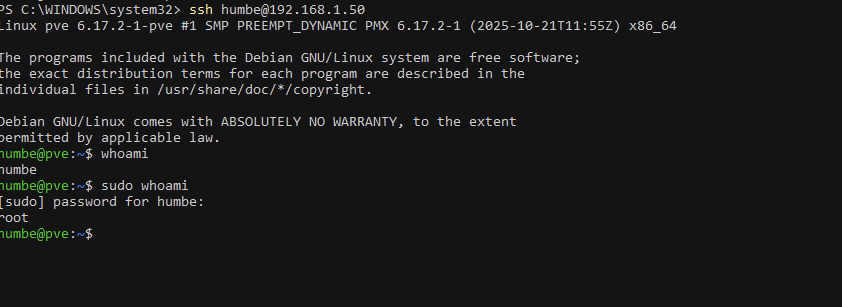

*Figure 1. SSH access as the named Proxmox account followed by controlled sudo elevation.*

## Proxmox SSH Hardening

Before editing the SSH daemon configuration, a dated backup was created. The following settings were added or confirmed in `/etc/ssh/sshd_config`:

```text
PermitRootLogin prohibit-password
PubkeyAuthentication yes
PasswordAuthentication no
```

These settings keep public-key authentication available while disabling password authentication and preventing ordinary direct root password login. The configuration was syntax-checked before the service was restarted:

```bash
sudo cp /etc/ssh/sshd_config /etc/ssh/sshd_config.bak.$(date +%F)
sudo sshd -t
sudo systemctl restart ssh
```

A second session as `humbe` succeeded. A direct root SSH test returned `Permission denied (publickey)`, confirming that root password login was blocked. The root password was changed separately for break-glass recovery; the value is not documented here.

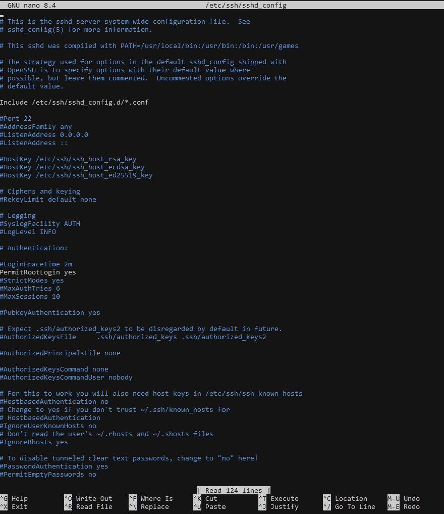

*Figure 2. SSH daemon settings showing public-key authentication and disabled password authentication.*

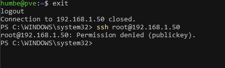

*Figure 3. Direct root SSH access rejected after the hardening change.*

## Proxmox Repository Cleanup

The initial package update failed because enterprise repositories were enabled without a subscription and returned `401 Unauthorized` from `enterprise.proxmox.com`. The enterprise repository files were disabled, the existing no-subscription repository was retained, and a duplicate no-subscription `.sources` file was removed after duplicate-target warnings were observed.

The resulting package update completed without 401 errors or duplicate repository warnings:

```bash
sudo apt update
```

The update reported 248 packages available to upgrade. That output describes package availability at the time of the session; it does not indicate that those upgrades were applied.

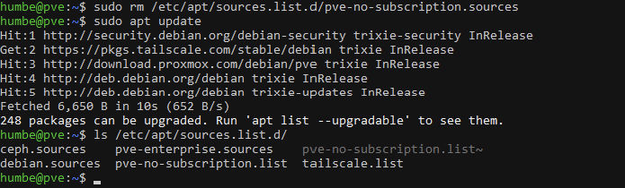

*Figure 4. Repository cleanup validated by an update without authorization or duplicate-target warnings.*

## Proxmox Firewall Enablement

The firewall was enabled only after management allow rules were added. The datacenter rules allow SSH and the Proxmox GUI from the home management LAN:

```text
ACCEPT in tcp from 192.168.1.0/24 to port 22
Comment: Allow SSH from home management LAN

ACCEPT in tcp from 192.168.1.0/24 to port 8006
Comment: Allow Proxmox GUI from home management LAN
```

The datacenter firewall was then enabled with inbound traffic set to `DROP` and outbound traffic set to `ACCEPT`. This reduces unsolicited access to the host while preserving administration from the management network.

The change was validated with a new SSH session as `humbe`:

```bash
ssh humbe@192.168.1.50
```

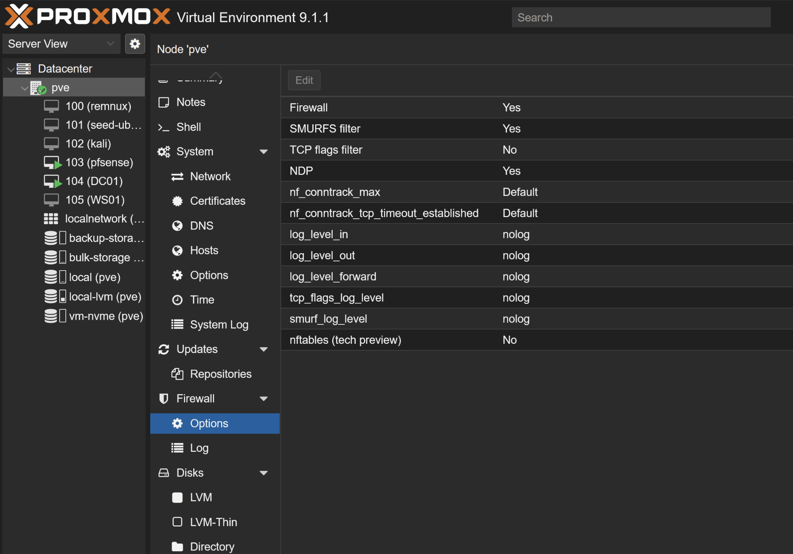

*Figure 5. Proxmox node firewall enabled with inbound policy set to `DROP`.*

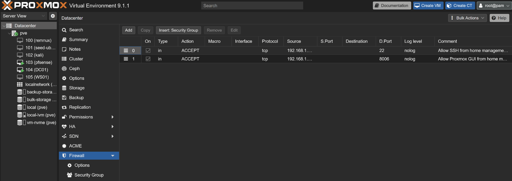

*Figure 6. Datacenter rules permitting SSH and the GUI from the management LAN.*

## pfSense Administrative Hardening

Access to the pfSense WebGUI initially failed because NordVPN interfered with local-subnet access. Disconnecting the VPN restored access for the administrative session.

The pfSense admin password was changed. WebGUI settings were reviewed and confirmed as follows:

- HTTPS was enabled on TCP port 443.
- SSH was disabled.
- DNS Rebind Check was enabled.
- HTTP referer enforcement was enabled.
- The anti-lockout rule was enabled.
- WebGUI login autocomplete was disabled for better credential hygiene.

A named pfSense user, `humbe`, was created in the `admins` group. The built-in admin account remained enabled as break-glass access. This preserves emergency recovery capability while providing a named identity for routine administration.

The interfaces were renamed for clarity:

```text
WAN_Home_Network_Uplink -> vtnet0
LAN_LabNetwork          -> vtnet1
```

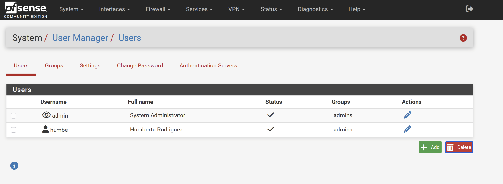

*Figure 7. pfSense user management showing the named administrator alongside the built-in break-glass account.*

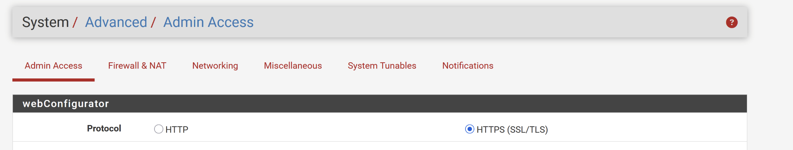

*Figure 8. pfSense WebGUI configured for HTTPS on TCP 443.*

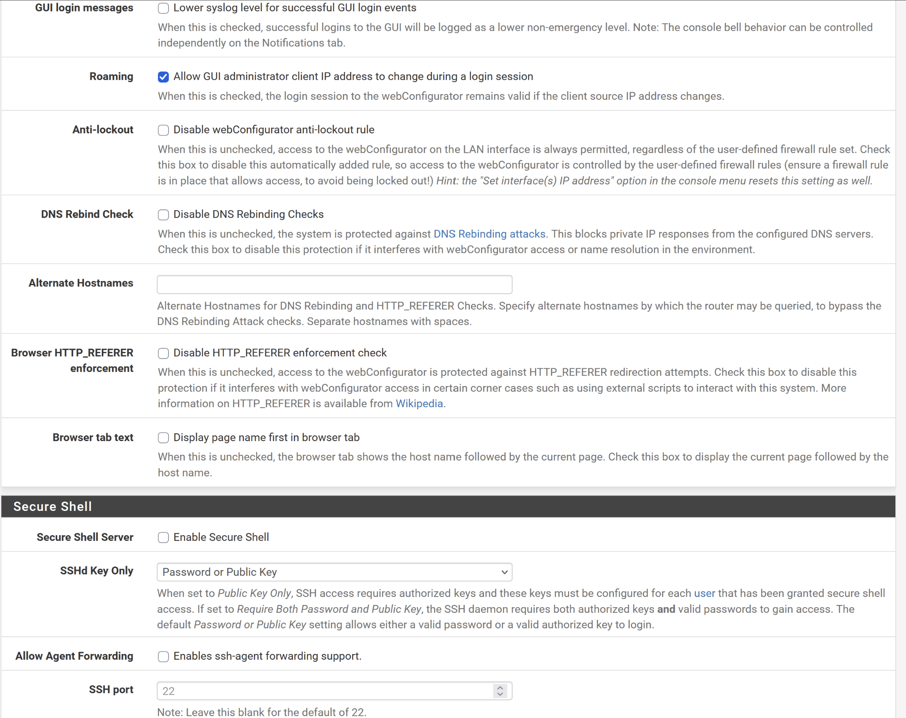

*Figure 9. Administrative protections retained while Secure Shell remains disabled.*

## pfSense Firewall and Service Review

The WAN rules contained no user-defined pass rules, so unsolicited inbound WAN management was blocked by default. The LAN rules contained the anti-lockout access for the LAN address on ports 443 and 80, along with the default allow-LAN-to-any and allow-LAN-IPv6-to-any rules.

The Tailscale firewall tab had no user-defined pass rules. Incoming traffic on that interface therefore remains blocked unless an explicit pass rule is later added.

Socket review showed the expected services:

```text
:443    pfSense HTTPS WebGUI
:80     webConfigurator redirect / anti-lockout behavior
:53     Unbound DNS
:67     DHCP
:123    NTP
:514    syslog
:41641  Tailscale
```

No SSH listener was present on port 22. DHCP was enabled for the lab LAN with subnet `192.168.10.0/24` and range `192.168.10.150 - 192.168.10.200`.

The review also identified that ISC DHCP has reached end-of-life and will be removed in a future pfSense version. This was recorded as a future task and was not changed during the session.

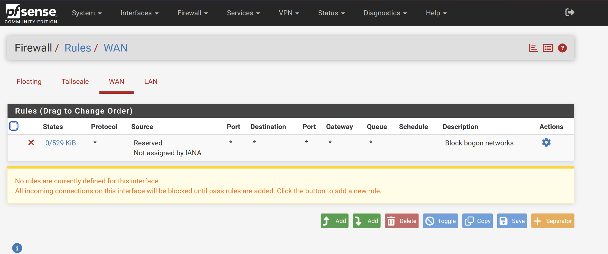

*Figure 10. WAN rules showing no user-defined inbound pass rules.*

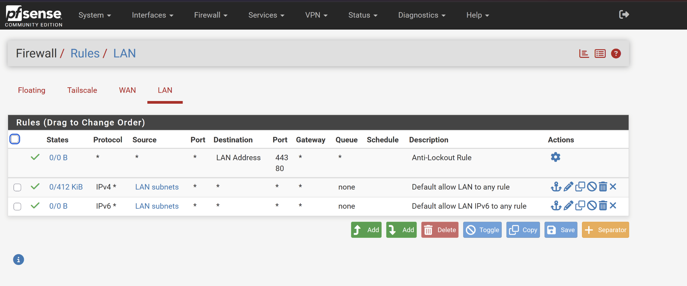

*Figure 11. LAN anti-lockout and default LAN rules reviewed during the session.*

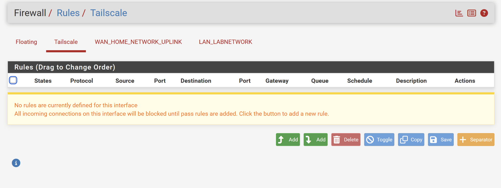

*Figure 12. Tailscale interface with no user-defined pass rules.*

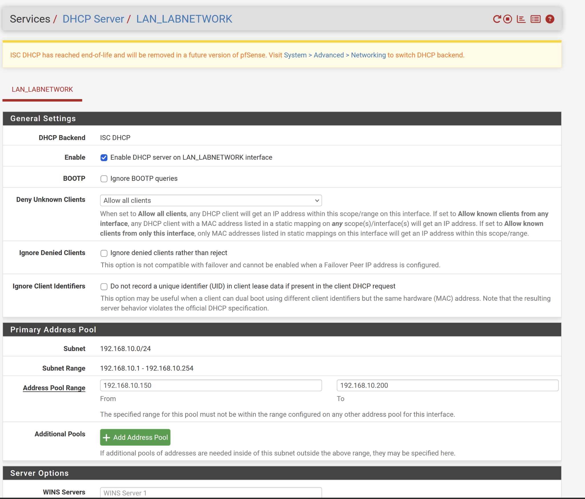

*Figure 13. Lab LAN DHCP scope and address pool, including the documented ISC DHCP lifecycle warning.*

## Backups and Recovery Artifacts

Before firewall enablement, a Proxmox backup directory and compressed archive were created containing network, repository, SSH, host identity, version, route, and firewall-status artifacts. A second archive was created after firewall enablement.

The post-firewall archive initially failed because `cluster.fw` was root-owned and the archive was created without sufficient privilege. The archive was recreated with `sudo tar`, ownership was returned to `humbe`, and its contents were checked for `cluster.fw`.

pfSense configuration was also downloaded through **Diagnostics → Backup & Restore → Download configuration as XML**. The XML itself and all archive contents remain private and are not reproduced here.

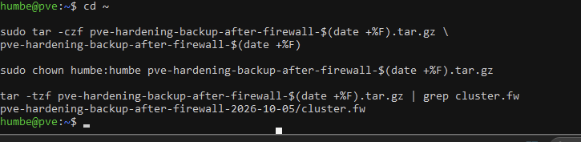

*Figure 14. Post-firewall Proxmox archive validation confirming the expected firewall artifact without publishing archive contents.*

## Issues Encountered and Troubleshooting

1. **Suspended Linux account creation:** `Ctrl+Z` suspended `adduser` and left a stopped job. `jobs` and `fg %1` resumed it so creation could complete.
2. **Existing Windows SSH key:** `ssh-keygen` reported that `id_ed25519` already existed. The key was not overwritten; the existing public key was reused.
3. **Enterprise repository authorization:** `apt update` returned 401 errors. The enterprise repository was disabled and the no-subscription repository was retained.
4. **Duplicate repository target:** A duplicate no-subscription `.sources` file caused warnings. It was removed, after which the update was clean.
5. **VPN interference:** NordVPN prevented local pfSense GUI access. The VPN was disconnected temporarily.
6. **Backup permissions:** `tar` could not read `cluster.fw`. The archive was recreated with `sudo tar`, then its ownership was changed back to `humbe`.

## Security Improvements

Completed improvements include:

- Named Proxmox administration through `humbe@pam` and RBAC.
- Sudo configured for controlled elevation.
- SSH password authentication disabled.
- Direct root SSH password login blocked.
- Proxmox inbound firewall policy set to `DROP`.
- Proxmox SSH and GUI allowed from the home management LAN.
- pfSense admin password changed.
- Named pfSense administrator created.
- pfSense WebGUI confirmed as HTTPS-based with SSH disabled.
- pfSense WAN reviewed with no user-defined inbound pass rules.
- Proxmox and pfSense recovery artifacts created before and after relevant changes.

## Lessons Learned

The hardening sequence matters. Establishing a named administrative path and creating recovery artifacts before enabling a host firewall reduced the risk of losing access. Testing a second SSH session after the firewall change provided a direct validation of the management rules.

The exercise also reinforced that operational details—VPN routing, stopped shell jobs, repository state, and file ownership—can affect security work as much as the intended configuration. Troubleshooting those conditions explicitly made the final state easier to validate.

## Future Improvements

The following items were not completed during this session:

- Plan and execute migration away from ISC DHCP before its removal in a future pfSense release.
- Review whether the default LAN allow rules should be narrowed for the lab’s actual services.
- Define Tailscale pass rules only where a documented management or service requirement exists.
- Continue validating backup restoration, not only backup creation and archive listing.
- Add publication-safe screenshots after reviewing and manually redacting any sensitive values.

!!! note "Screenshot publication scope"
    Screenshots containing password-entry prompts, SSH-key generation details, socket listings with broader endpoint information, backup archive listings, or workflow/setup material were intentionally excluded. The published images show configuration state and validation outcomes only.
